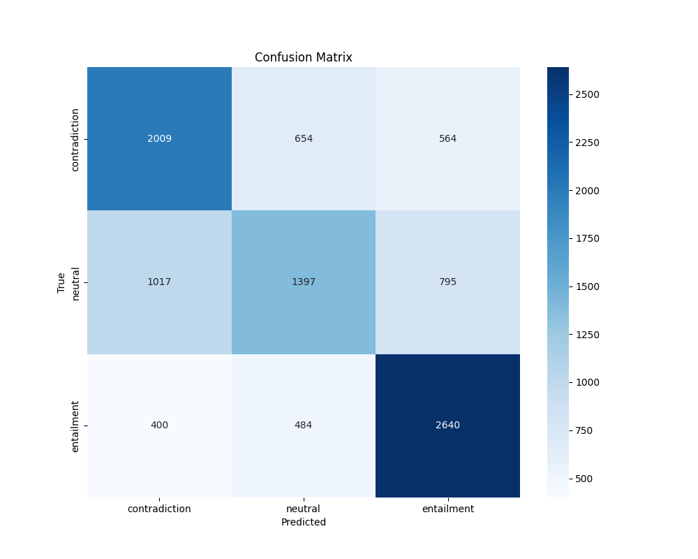

# Linguistic Tree Matching Networks

This module contains an adaptation of Graph Matching Networks (GMN) for linguistic dependency trees, specifically focused on natural language inference and semantic similarity tasks. It leverages the TMN_DataGen package for preprocessing text into tree format.

## Architecture Overview

The implementation supports multiple model architectures:

### Tree Matching Networks (TMN)
- **TreeMatchingNet**: Extends GMN with cross-graph attention to compare dependency trees directly
- **TreeEmbeddingNet**: Creates independent embeddings for each tree, then compares

### BERT Baselines
- **BertMatchingNet**: BERT with cross-attention for sentence pair comparison
- **BertEmbeddingNet**: Independent BERT embeddings with similarity comparison

## Configuration System

Flexible configuration system, supporting different tasks and models.

### Base Configuration

The base configuration comes from `configs/default_tree_config.py` which extends GMN's original configuration with tree-specific parameters. You can override it in three ways:

1. Passing a YAML file path to `get_tree_config(base_config_path=...)`
2. Passing an override YAML path for specific parameters
3. Directly updating the config dict

### Task-Specific Configurations

I included pre-defined configurations in `configs/experiment_configs/`:

- `aggregative_config.yaml`: Used for all text-level training and evaluation
- `contrastive_config.yaml`: Used for pretraining with contrastive learning (legacy)

### Important Configuration Parameters

#### Model Configuration
```yaml
model:
  task_type: "similarity" | "entailment" | "binary" | "infonce"
  task_loader_type: "aggregative"  # Use this for all current training
  model_type: "matching" | "embedding"
  node_feature_dim: 804  # Dimension of node features (BERT + one-hot encodings)
  edge_feature_dim: 70   # Dimension of edge features
  node_state_dim: 1024   # Internal node state dimension
  edge_state_dim: 256    # Internal edge state dimension
  edge_hidden_sizes:     # Defines internal hidden sizes / number of layers in edge propagation MLP
    - 512 
  node_hidden_sizes:     # Defines internal hidden sizes / number of layers in node propagation MLP
    - 1024 
  n_prop_layers: 5       # Number of graph propagations

  graph_rep_dim: 1792    # The final graph embedding dimension
  graph_transform_sizes: # Defines internal hidden sizes / number of layers in graph aggregation network
    - 1024

  # other parameters in this area defined and detailed in GMN config docs
  
  # For entailment tasks
  thresh_low: -0.33      # Threshold for contradiction class
  thresh_high: 0.33      # Threshold for entailment class
  
  # For contrastive learning
  temperature: 0.05      # Temperature for scaling similarity scores

  # For custom contrastive goals:
  positive_infonce_weight : 1.0  # Value to multiply the loss for the infonce loss based on the similarity matrix in TextLevelContrastiveLoss
  inverse_infonce_weight : 1.0  # Value to multiply the loss for the infonce loss based on the distance matrix in TextLevelContrastiveLoss
  midpoint_infonce_weight : 1.0  # Value to multiply the loss for the infonce loss based on the midpoint matrix in TextLevelContrastiveLoss
  
```

#### Data Configuration
```yaml
data:
  dataset_type: "snli" | "semeval" | "patentmatch_balanced" | "wikiqs"
  batch_size: 256        # Number of trees per batch
  strict_matching: False # Whether to use strict matching
  contrastive_mode: True # Whether to use contrastive learning
  min_trees_per_group: 1 # Minimum number of trees per group
```

#### Training Configuration
```yaml
train:
  learning_rate: 0.000001
  n_epochs: 500
  patience: 10           # Early stopping patience
```

#### Wandb Setup

1. Install requirements:
```bash
pip install -r requirements.txt
```

2. Configure WandB:
```bash
wandb login
```

## Models and Loss Functions

### Model Types

- **TreeMatchingNet**: Uses cross-graph attention to compare trees directly. Processes on pairs.
- **TreeEmbeddingNet**: Creates independent embeddings for each tree.
- **BertMatchingNet**: Bert augmented with cross attention between hidden states after each transformer layer. Processes on pairs.
- **BertEmbeddingNet**: Simple Bert but configurable with the same parameters (Todo: ensure training pipeline supports)

### Loss Types

The loss choice depends on your task type:

1. **Text-Level Losses** (These use aggregated embeddings across multiple sentences from the same text to compare)
   - `TextLevelSimilarityLoss`: For semantic similarity (regression)
   - `TextLevelEntailmentLoss`: For the entailment task
   - `TextLevelBinaryLoss`: For binary classification
   - `TextLevelContrastiveLoss`: For contrastive learning with custom infonce, controlled by weights in config

2. **Strict Sentence Pair Losses** (These compare single embeddings from individual sentences extracted out of texts)
   - `InfoNCELoss`: Contrastive loss - for pretraining
   - `SimilarityLoss`: Direct similarity scoring
   - `EntailmentLoss`: Classification approach

### Task Types

Each task uses a different loss function and evaluation metrics:

- **Similarity**: Uses cosine similarity to predict a continuous similarity score
- **Entailment**: Classifies text pairs as entailment (1), neutral (0), or contradiction (-1)
- **Binary**: Binary classification for tasks like patent matching
- **InfoNCE**: Contrastive learning task for pretraining and primary training

## Data Handling

The `PairedGroupsDataset` is the primary data handler for already pretrained models. It:
1. Loads preprocessed tree data from TMN_DataGen, or line by line text data (for BERT)
2. Handles tree aggregation for text-level processing
3. Supports both direct labeled learning and contrastive learning

The `DynamicCalculatedContrastiveDataset` is the data handler for pretraining models. It:
1. Loads preprocessed tree data from TMN_DataGen, or line by line text data (for BERT)
2. Handles pair organization with variable positive/negative pairing for contrastive pretraining
3. Supports only contrastive learning

## Training

To pretrain a model (recommended if starting from scratch), use:

```bash
python -m Tree_Matching_Networks.LinguisticTrees.experiments.train_unified \
  --config configs/experiment_configs/contrastive_config.yaml \
  --mode constrastive \
  --data_root /path/to/data/folder/ \
  --task_type infonce
```
Note: data folder should contain folders dev, train, and test, each containing folders for each dataset, like:
```
dev/snli_1.0_dev_converted_sm/
test/snl1_1.0_test_converted_sm/
train/snli_1.0_train_converted_sm/
```
So the format is like: `{dataset_name}_{split}_converted_{spacy_variant}`, see tree_data_config.py and (section below on this) for more details. TODO: simplify this structure    

And for training a model in primary training/fine tuning:
```bash
python -m Tree_Matching_Networks.LinguisticTrees.experiments.train_unified \
  --config configs/experiment_configs/aggregative_config.yaml \
  --mode aggregative \
  --data_root /path/to/data/folder/ \
  --task_type <one of infonce, similarity, entailment, etc.>
```
Control of the model sizes and data used is done through the config files, more details on how to use those (insert anchor link to config explanation)

### Training Arguments

- `--config`: Path to configuration file (default: aggregative_config.yaml)
- `--override`: Override specific config parameters
- `--resume`: Path to checkpoint to resume from
- `--resume_with_epoch`: Resume from the same epoch number (for crashed runs)
- `--ignore_patience`: Ignore early stopping patience
- `--data_root`: root location of data directory

## Evaluation

To evaluate a trained model:

```bash
python -m Tree_Matching_Networks.LinguisticTrees.experiments.eval_aggregated \
  --checkpoint /path/to/checkpoint \
  --batch_size 256 \
  --output_dir evaluation_results
```

### Evaluation Arguments

- `--checkpoint`: Path to model checkpoint
- `--batch_size`: Batch size for evaluation (optional)
- `--output_dir`: Directory to save results
- `--use_wandb`: Log results to Weights & Biases
- `--config`: Optional config override
- `--data_root`: root location of data directory

Note: when you give a checkpoint file at `/path/to/checkpoint_dir/checkpoint/model.pt`, the script searches for    
the config at `/path/to/checkpoint_dir/config/config.yaml`. This file must be present for the script to function.    
The config file given is the config the model was trained with. This is usually the correct config to use, but you can    
pass the `--config` argument to override it. Overriding in this way is usually necessary when training a model in multiple stages.

### Data root dir
Important note: the data root directory should contain 3 directories, train, test, and dev.    
Each of these should contain directories that are the specific processed dataset split.    
The directory names of these must follow the patterns laid out in config/tree_data_config.py.    
The general format is `{base_dataset}_{split}_converted_{spacy_variant}` with `_sharded` added if you   
set "sharded = true" when setting up the tree data config for that split. The base dataset is determined by    
what is entered into the dataset_spec config variable. For each item you include in the dataset_spec,    
data files will be looked for at that path and included as data to be used, meaning multiple datasets can be used at once.   
If you do not define dataset_specs, the base_dataet is determined by the dataset_type config, eg 'snli', and it expects one directory.

## Results

My best model on the SNLI entailment task achieved approximately 60% accuracy on the test set. While this does not match SOTA BERT models (90%+), 
its ability to learn at all with so few parameters is promising. However, more experiments increasing the number of parameters and comparing against scaled down
versions of BERT based models are needed to draw more meaningful conclusions about the potential of this kind of tree based approach.

### Confusion Matrix



The model shows higher accuracy for entailment and contradiction classes, with more difficulty on the neutral class.

### Performance Comparison

| Model | Parameters | SNLI Accuracy |
|-------|------------|---------------|
| EFL + RoBERTa-large from Wang et al., '21 | 355M | ~90% |
| TMN | <60K | ~60% |

## Further Work

Potential improvements include:
- More extensive pretraining on larger datasets
- Applying to additional tasks like SemEval
- Exploring more sophisticated tree aggregation methods

## References

This implementation is based on the following papers:
- Li et al. "Graph Matching Networks for Learning the Similarity of Graph Structured Objects" (ICML 2019)
- Wang et al. "Entailment as Few-Shot Learner" (2021)
- Bowman et al. "A large annotated corpuse for learning natural language inference" (EMNLP 2015)
